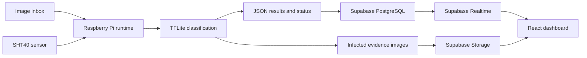

<p align="center">
  
</p>

<h1 align="center">PollinSight</h1>

<p align="center">
  A smart beehive monitoring demo that turns edge observations into clear,
  actionable insights for beekeepers.
</p>

## Overview

PollinSight explores how computer vision, environmental sensing, and a live
dashboard can support earlier detection of hive-health problems.

The project focuses on three connected signals:

- **Bee activity** at the hive entrance
- **Temperature and humidity** around the colony
- **Varroa risk**, supported by classified evidence images

Instead of exposing raw measurements, the interface presents health indicators,
alerts, trends, device status, and visual evidence in a form that can be
understood quickly.

> This repository contains a demonstration prototype, not a production-ready
> hive-health or veterinary diagnostic system.

## What the Demo Includes

### Dashboard

The React dashboard provides three main views:

- **Activity**: apiary selection, hive activity, environmental readings, device
  health, and daily comparisons
- **Report**: date-based Varroa reports, severity information, and evidence
  galleries
- **Demo**: live edge-processing stages, classification results, sensor status,
  environmental charts, and infected-bee evidence

The interface supports both **English and Italian**, with the selected language
persisted in the browser.

The Activity and Report sections demonstrate the broader product experience
with mock domain data. The Demo section connects to Supabase and displays the
latest edge-device run, including honest waiting, offline, degraded, and error
states.

### Raspberry Pi Edge Runtime

The public `raspberry-fona/` package demonstrates an autonomous edge workflow:

1. Read temperature and humidity from an SHT40 sensor
2. Accept complete one-bee images from a local inbox
3. Classify each image with a bundled TensorFlow Lite MobileNetV2 model
4. Count healthy and potentially infected observations
5. Preserve infected images as evidence
6. Publish results and status updates to Supabase
7. Archive processed images and retry failed uploads from disk

The service runs under `systemd`, supports scheduled classification and
periodic telemetry, and continues classification in degraded mode if the
environmental sensor is unavailable.

Camera capture is not implemented in this repository. The current runtime
expects another component to place stable `.jpg`, `.jpeg`, or `.png` one-bee
images into `raspberry-fona/images/inbox/`.

## Architecture



The edge device performs local inference and sends structured results rather
than a continuous image stream. Supabase stores the current run and evidence,
while Realtime updates the Demo interface without a page refresh.

## Demo Data Flow

A run moves through these persisted stages:

```text
Connecting -> Reading sensor -> Classifying -> Uploading -> Complete
```

The dashboard can display:

- Number of analyzed, healthy, and infected bee images
- Classification progress and processing duration
- Temperature, humidity, sensor state, and device freshness
- Filename and capture time for each evidence image
- Live environmental updates
- Explicit waiting, stale-data, sensor-offline, and failure states

An infected classification represents an **infected-bee observation**. It
should not be interpreted as a verified count of individual mites.

## Technology

| Layer | Technologies |
| --- | --- |
| Frontend | React, TypeScript, Vite, Tailwind CSS |
| Backend | Supabase PostgreSQL, Realtime, Storage |
| Edge runtime | Python, TensorFlow Lite, Pillow, NumPy |
| Sensors and modem | SHT40, Adafruit FONA 800 |
| Operations | `systemd`, local persistence, scheduled jobs |

## Repository Structure

```text
src/                 React dashboard and localization
public/              Brand and static assets
supabase/migrations/ Demo database, policies, Storage, and Realtime setup
raspberry-fona/      Self-contained Raspberry Pi edge package
```

Private credentials, runtime state, logs, archives, and captured inbox images
are intentionally excluded from version control.

## Run the Dashboard

Requirements:

- Node.js
- npm
- A Supabase project configured with the included demo migration

Install dependencies and start the development server:

```bash
npm install
npm run dev
```

Create an `.env.local` file for live Demo data:

```env
VITE_SUPABASE_URL=your_supabase_project_url
VITE_SUPABASE_PUBLISHABLE_KEY=your_publishable_key
```

The browser variables are read-only. Write-capable credentials belong only in
the edge runtime environment and must never be added to frontend code or
committed to Git.

## Useful Commands

```bash
npm run dev
npm run typecheck
npm run lint
npm run build
```

Instructions for configuring and running the edge package are available in
[`raspberry-fona/README.md`](raspberry-fona/README.md).

## Prototype Status

The dashboard, Supabase integration, image pipeline, local persistence,
scheduler, retry behavior, mock sensor path, and TensorFlow Lite batch flow are
implemented as part of the demo.

The complete final-product vision includes continuous camera acquisition,
long-term historical analytics, validated hive-health scoring, notifications,
and field-tested hardware operation. Those capabilities remain outside the
validated scope of this repository.
